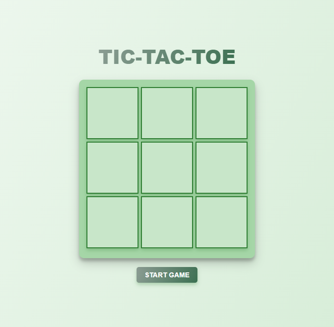
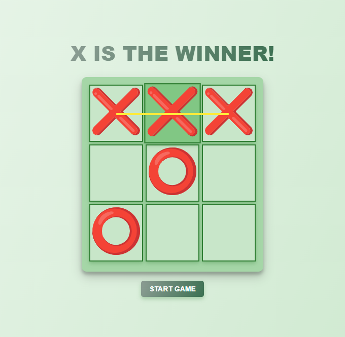

# Игра Крестики-нолики

Простая и интерактивная игра "Крестики-нолики" с современным стилем, анимацией и звуковыми эффектами. Проект создан с использованием HTML, CSS и JavaScript, обеспечивая приятный пользовательский опыт с функциями, такими как анимированные линии выигрыша, текст с градиентом и звуки.

## Возможности

- **Интерактивный игровой процесс**: Игроки могут соревноваться, играя за "X" и "O".
- **Анимация линии выигрыша**: Игра подчеркивает выигрышную комбинацию с помощью анимированной линии.
- **Адаптивный дизайн**: Игра корректно отображается на экранах разных размеров.
- **Текст с градиентом**: Стильный текст с градиентной заливкой для улучшения визуального восприятия.
- **Звуковые эффекты**: Добавлены звуки клика при каждом ходе и звук победы для акцентирования результата игры.

## Использованные технологии

- **HTML**: Структура игры.
- **CSS**: Стили, анимация и адаптивный дизайн.
- **JavaScript**: Логика игры, манипуляции с DOM и воспроизведение звуков.

## Как запустить

1. Склонируйте или скачайте репозиторий.
2. Убедитесь, что файлы звуков (`click-sound.mp3`, `victory-sound.mp3`) находятся в папке `sounds`.
3. Откройте файл `index.html` в вашем веб-браузере.
4. Начните игру, нажав кнопку "Start Game".

## Скриншоты

  
   

